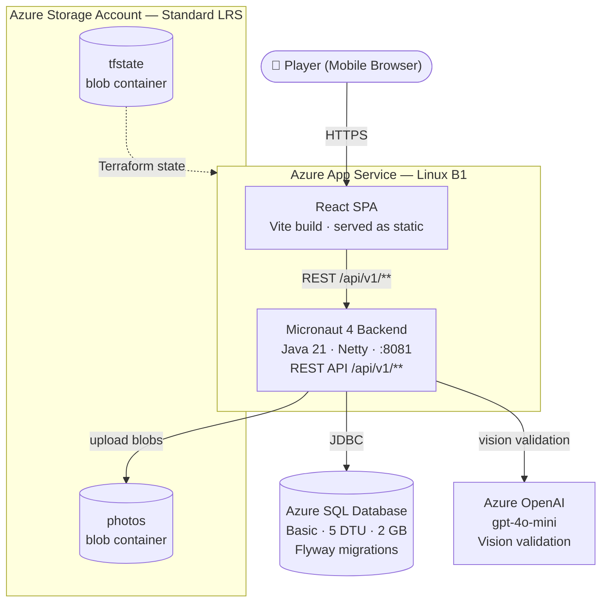

# Ko Pha Ngan Quest

A mobile-first scavenger hunt web app for Ko Pha Ngan, Thailand. One player, 8 missions, 3–4 days of exploration — ending with two spicy challenges.

---

## Architecture



---

## Tech Stack

| Layer | Technology |
|---|---|
| Frontend | React 18, TypeScript (strict), Vite, Tailwind CSS |
| Backend | Micronaut 4.x, Java 21 (virtual threads), Netty |
| Database | Microsoft SQL Server, Micronaut Data JDBC, Flyway |
| Storage | Azure Blob Storage (photo uploads) |
| AI Validation | Azure OpenAI — gpt-4o-mini (vision prompt, yes/no) |
| Auth | JWT (HS256, 90-day expiry) |
| Infrastructure | Terraform, Azure App Service |
| CI/CD | GitHub Actions (OIDC, no stored credentials) |

---

## Repository Structure

```
pha-ngan-quest-combine/
├── frontend/               # React SPA
│   ├── src/
│   │   ├── pages/          # Index.tsx — game state + mission rendering
│   │   ├── components/     # WelcomeScreen, ActiveMission, CompletedMission, etc.
│   │   ├── services/       # httpClient, missionsService, playersService
│   │   └── data/missions.ts
│   └── ...
├── backend/                # Micronaut API
│   ├── src/main/java/com/kpnquest/
│   │   ├── shared/         # BlobStorageService, AiPhotoValidationService, domain entities
│   │   ├── identifyplayer/ # POST /api/v1/players/identify
│   │   ├── loadmissions/   # GET  /api/v1/missions
│   │   ├── completemission/# POST /api/v1/missions/{id}/complete
│   │   ├── uploadphoto/    # POST /api/v1/missions/{id}/photos
│   │   ├── getphoto/       # GET  /api/v1/players/{id}/missions/{missionId}/photo
│   │   ├── validatephoto/  # POST /api/v1/missions/{id}/photos/validate
│   │   ├── approvephoto/   # POST /api/v1/missions/{id}/photos/{photoId}/approve
│   │   └── listplayercompletions/ # GET /api/v1/players/{id}/completions
│   └── src/main/resources/db/migration/   # Flyway SQL migrations
├── infra/                  # Terraform
│   ├── main.tf
│   ├── variables.tf
│   ├── outputs.tf
│   ├── providers.tf
│   └── backend.tf
├── .github/workflows/
│   └── deploy-infrastructure.yml
└── docker-compose.yml      # Local SQL Server
```

---

## API Reference

All endpoints except `/api/v1/players/identify` require `Authorization: Bearer <jwt>`.

| Method | Endpoint | Auth | Description |
|---|---|---|---|
| POST | `/api/v1/players/identify` | — | Login by username, returns JWT |
| GET | `/api/v1/missions` | JWT | List all 8 missions |
| POST | `/api/v1/missions/{id}/complete` | JWT | Mark mission complete |
| POST | `/api/v1/missions/{id}/photos` | JWT | Upload proof photo (base64 → blob) |
| POST | `/api/v1/missions/{id}/photos/validate` | JWT | AI validation via Azure OpenAI gpt-4o-mini |
| POST | `/api/v1/missions/{id}/photos/{photoId}/approve` | JWT + admin | Manual admin approval |
| GET | `/api/v1/players/{id}/completions` | JWT | List player's completed missions |
| GET | `/api/v1/players/{id}/missions/{missionId}/photo` | JWT | Get photo blob URL + status |

### Photo validation statuses

| Status | Meaning |
|---|---|
| `PENDING` | Photo uploaded, not yet validated |
| `AI_APPROVED` | Azure OpenAI confirmed all expected elements are present |
| `AI_REJECTED` | AI could not confirm — awaiting admin review |
| `ADMIN_APPROVED` | Admin manually approved |
| `ADMIN_REJECTED` | Admin rejected |

---

## Local Development

### Prerequisites

- Java 21
- Node.js 20+
- Docker Desktop

### 1. Start the database

```bash
SA_PASSWORD=YourStrong!Passw0rd docker compose up -d
```

### 2. Start the backend

```bash
cd backend
cp .env.example .env   # fill in SA_PASSWORD, JWT_SECRET, AZURE_* vars
MICRONAUT_ENVIRONMENTS=dev ./gradlew runWithVars
# API available at http://localhost:8081
```

### 3. Start the frontend

```bash
cd frontend
npm install
npm run dev
# App available at http://localhost:8080
```

---

## Environment Variables

### Backend (`.env` in `backend/`)

| Variable | Description |
|---|---|
| `SA_PASSWORD` | SQL Server SA password |
| `JWT_SECRET` | Secret for signing JWTs (min 32 chars) |
| `AZURE_STORAGE_CONNECTION_STRING` | Blob storage connection string (use Azurite for local dev) |
| `AZURE_OPENAI_ENDPOINT` | Azure OpenAI endpoint URL |
| `AZURE_OPENAI_API_KEY` | Azure OpenAI API key |

**Azurite (local blob emulator) connection string:**
```
DefaultEndpointsProtocol=http;AccountName=devstoreaccount1;AccountKey=Eby8vdM02xNOcqFlqUwJPLlmEtlCDXJ1OGLjX+N6proVRHQP+ik6V3NZP1rTbMPANtJ10FJz/QzGNnl0MJzaAQ==;BlobEndpoint=http://127.0.0.1:10000/devstoreaccount1;
```

### Frontend

| Variable | Description |
|---|---|
| `VITE_API_BASE_URL` | Backend base URL (empty = same origin in production) |

---

## Infrastructure (Terraform)

### First-time setup

#### 1. Create an Azure AD app registration for OIDC

```bash
az ad app create --display-name "kpn-quest-github-actions"
# Note the appId → AZURE_CLIENT_ID
az ad sp create --id <appId>
az role assignment create --role Contributor \
  --assignee <appId> --scope /subscriptions/<AZURE_SUBSCRIPTION_ID>
```

Add a federated credential on the app registration:
- **Issuer:** `https://token.actions.githubusercontent.com`
- **Subject:** `repo:<org>/<repo>:ref:refs/heads/main`

#### 2. Add GitHub Secrets

| Secret | Value |
|---|---|
| `AZURE_CLIENT_ID` | App registration client ID |
| `AZURE_TENANT_ID` | Azure tenant ID |
| `AZURE_SUBSCRIPTION_ID` | Azure subscription ID |
| `TF_VAR_SQL_ADMIN_PASSWORD` | SQL admin password |
| `TF_VAR_JWT_SECRET` | JWT signing secret |
| `AZURE_WEBAPP_NAME` | App Service name from Terraform output (`app-kpnquest-<suffix>`) — set after first `terraform apply` |

#### 3. Phase 1 — initial apply (local state)

```bash
cd infra
terraform init
terraform plan
terraform apply
# Note the storage_account_name output
```

#### 4. Phase 2 — migrate state to Azure Blob

Edit `backend.tf`, uncomment the `azurerm` backend block, and fill in the storage account name from the output above. Then:

```bash
terraform init -migrate-state
```

From this point on the pipeline manages state automatically.

---

## Players

Three players are seeded in the database:

| Username | Admin |
|---|---|
| `godmod` | Yes |
| `elchico` | No |
| `coelhinha` | No |

Login via `POST /api/v1/players/identify` with `{ "username": "..." }`.
