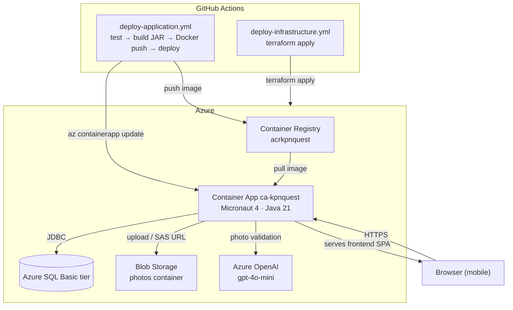

# Ko Pha Ngan Quest

A mobile-first scavenger hunt web app for Ko Pha Ngan, Thailand. Guides one player through 8 missions over 3–4 days — exploration, challenges, and photo uploads validated by AI.

## Architecture



## Tech stack

| Layer | Technology |
|---|---|
| Frontend | React 18 · TypeScript · Tailwind CSS |
| Backend | Micronaut 4.x · Java 21 · Micronaut Data JDBC |
| Database | Azure SQL (MSSQL) · Flyway migrations |
| Storage | Azure Blob Storage |
| AI | Azure OpenAI (gpt-4o-mini) — photo validation |
| Hosting | Azure Container Apps (1 replica, always on) |
| IaC | Terraform |
| CI/CD | GitHub Actions + OIDC (no long-lived secrets) |

## Repository structure

```
├── backend/          # Micronaut Java backend + Dockerfile
├── frontend/         # React SPA (git submodule)
├── infra/            # Terraform (Azure infrastructure)
├── local/            # Docker Compose — local MSSQL only
└── .github/workflows/
    ├── deploy-application.yml    # triggered by backend/** or frontend/** changes
    └── deploy-infrastructure.yml # triggered by infra/** changes
```

## Local development

### 1. Create `backend/.env`

```env
SA_PASSWORD=Password123!
JWT_SECRET=your-secret-at-least-256-bits-long-for-hs256
AZURE_STORAGE_CONNECTION_STRING=UseDevelopmentStorage=true
AZURE_OPENAI_ENDPOINT=https://localhost
AZURE_OPENAI_API_KEY=dummy
```

### 2. Start the database

Both scripts load variables from `backend/.env` automatically and forward all arguments to `docker compose`.

**macOS / Linux / Git Bash:**
```bash
./local/dev-db.sh up -d
./local/dev-db.sh down
./local/dev-db.sh logs -f db
```

**Windows (cmd.exe):**
```cmd
local\dev-db.cmd up -d
local\dev-db.cmd down
local\dev-db.cmd logs -f db
```

### 3. Start the backend

```bash
cd backend && ./gradlew runWithVars
```

### 4. Start the frontend

```bash
cd frontend && npm run dev
```

## CI/CD

Push to `main` automatically:
- triggers `deploy-application.yml` when `backend/**` or `frontend/**` changes
- triggers `deploy-infrastructure.yml` when `infra/**` changes

Documentation-only changes (`.md` files) do not trigger any pipeline.